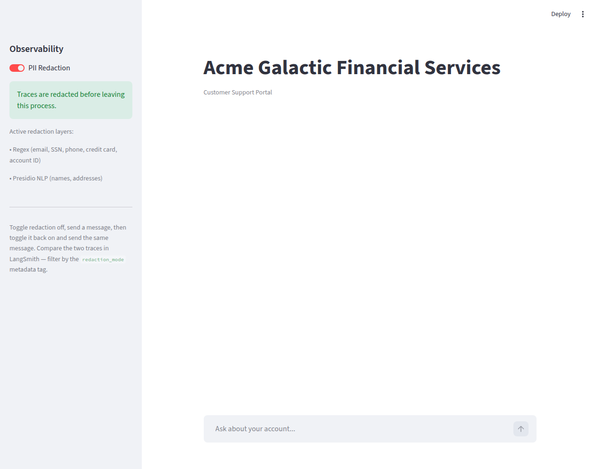
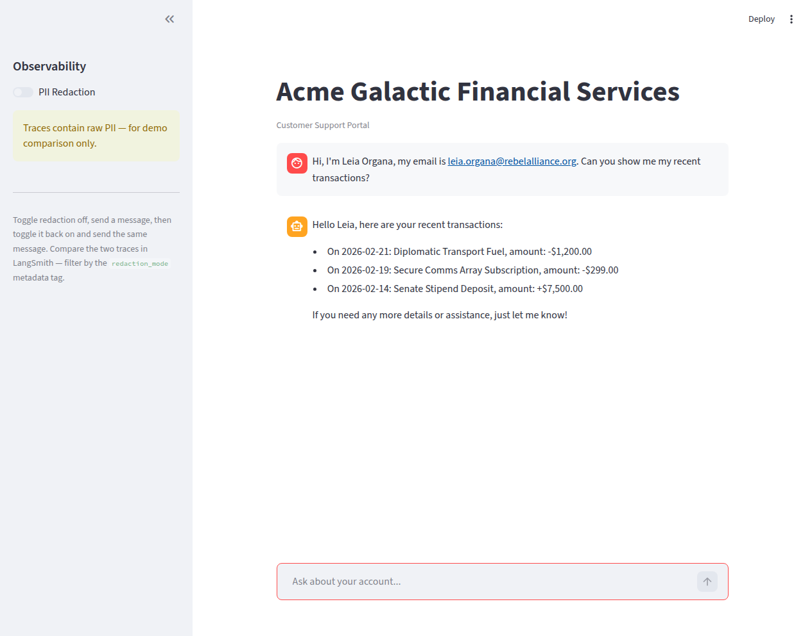
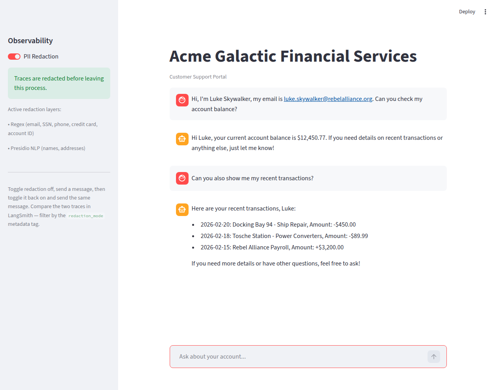
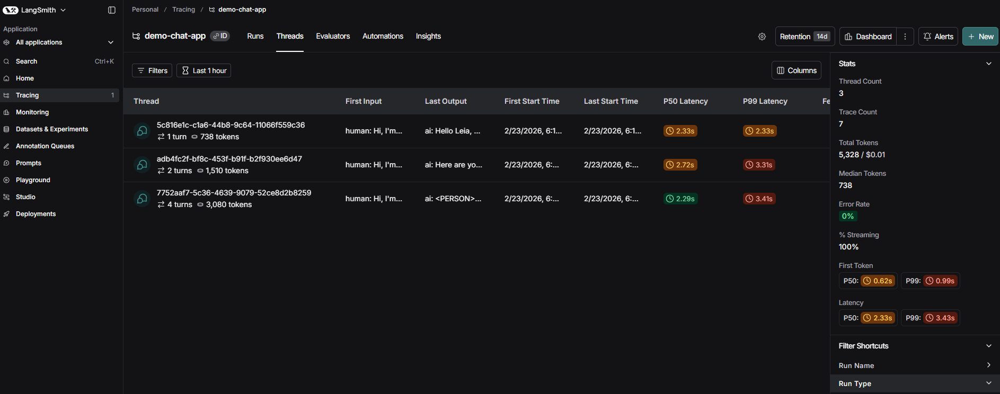
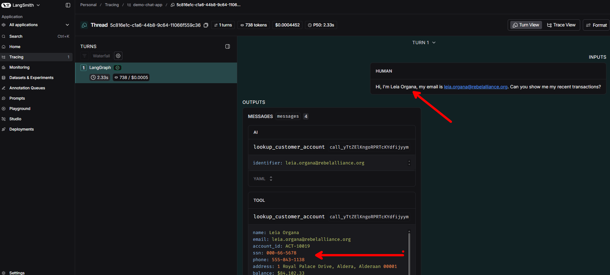
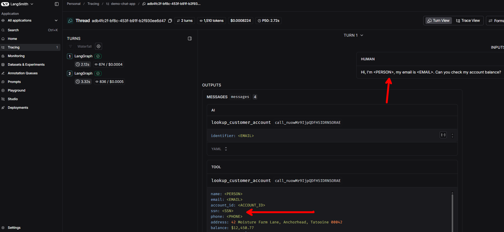

# Implementing Compliant AI Tracing with LangSmith

The NIST AI Risk Management Framework (AI RMF 1.0) asks organizations to monitor their AI systems in production, explain how they reach decisions, and protect the privacy of people whose data flows through them. These aren't competing requirements — but they feel like it when your traces contain customer SSNs.

This post shows how to resolve that tension. We'll build a working demo that captures the traces the framework demands using LangSmith, walk through the instrumentation decisions that make it work (streaming, thread linking, per-request tracing configuration), and demonstrate how client-side PII redaction keeps sensitive data out of your trace store. Then we'll look at how this scales from a single application to an organization-wide architecture using the OpenTelemetry Collector.

## What the Framework Asks For

The AI RMF expects organizations to monitor AI systems in production, explain how they reach decisions, track risks over time, and respond to incidents — subcategories like MEASURE 2.4 and MANAGE 4.1 make this explicit. At the same time, the framework treats privacy as a core trustworthiness characteristic, calling for data minimization and privacy-enhancing technologies. When your AI system processes customer data, the traces of those interactions contain the same sensitive data. Redacting before persistence lets you keep full observability without persisting the sensitive content.

## LangSmith: What It Captures and Why It Matters

LangSmith is LangChain's observability platform for LLM applications. While it originates from the LangChain ecosystem, it's framework-agnostic — it works with OpenAI, Anthropic, Azure OpenAI, LlamaIndex, or custom implementations.

Every execution of an LLM application produces a **trace**: a hierarchical record of every step the system took. A trace is composed of nested "runs" forming a tree structure. For an agent with tool calls, the trace captures:

```
Trace #a1b2c3
├── User message received (input text, timestamp)
├── LLM Call — model decides to invoke a tool
│     ├── Input tokens: 2,847 | Output tokens: 42
│     └── Latency: 1,340ms
├── Tool: lookup_customer_account
│     ├── Input: {"identifier": "luke.skywalker@rebelalliance.org"}
│     └── Output: {full customer profile JSON}
│     └── Latency: 3ms
├── LLM Call — synthesizes response from tool result
│     ├── Input tokens: 3,102 | Output tokens: 156
│     └── Latency: 890ms
└── Final response returned to user
```

Every intermediate step is visible — inputs, outputs, latency, token counts, errors, and arbitrary metadata. This single trace simultaneously provides evidence for multiple framework requirements: it satisfies **MEASURE 2.4** (production monitoring) because the trace *is* the monitoring record, **MEASURE 2.9** (explainability) because the run tree explains exactly how the system arrived at its output, **MEASURE 3.1** (risk tracking) because persistent trace storage creates a longitudinal record of system behavior, and **MANAGE 4.1** (post-deployment monitoring) because LangSmith's dashboards and alert configurations built on top of traces constitute the implemented monitoring plan.

One trace, multiple compliance requirements addressed. This density means organizations don't need separate systems for each obligation — the observability layer is the compliance layer.

## The Problem: PII in Every Layer

Here's where the tension becomes concrete. Consider a customer support agent handling account inquiries. A user writes:

> "Hi, I'm Luke Skywalker, my email is luke.skywalker@rebelalliance.org, SSN 000-42-1234. Can you check my balance?"

The agent calls a tool to look up the account, receives back the customer's full profile, and synthesizes a response. PII appears at **every level** of the resulting trace:

| Trace Layer | PII Present |
|---|---|
| User message | Name, email, SSN |
| Tool call arguments | Email (used as lookup key) |
| Tool response | Full profile: name, SSN, phone, address, transactions |
| Agent's final answer | Name, account balance |

If these traces are shipped to a cloud-hosted observability platform — even one with strong security practices — the organization now has customer SSNs and financial data stored in a third-party system.

There are several ways to resolve this — access controls, data retention policies, encryption at rest — but the most direct is to never persist the sensitive data in the first place. Client-side redaction, using hooks that LangSmith provides for exactly this purpose, strips PII before the trace payload leaves your application process.

## LangSmith's Redaction Architecture

LangSmith's `create_anonymizer` hook operates **client-side**, before the trace payload is serialized and sent over the network. This is one of two approaches we'll cover — the other, using the OpenTelemetry Collector as a centralized redaction layer, is discussed in the production architecture section below. The client-side approach is the strongest privacy posture: unlike server-side scrubbing, PII never crosses a trust boundary. Your application process is the perimeter.

### The Anonymizer API

LangSmith's `create_anonymizer` function takes either a list of regex patterns or a custom function, and returns an anonymizer that recursively walks the entire trace payload — every string in every nested dict, list, or value — applying the transformation.

```python
from langsmith.anonymizer import create_anonymizer
from langsmith import Client

anonymizer = create_anonymizer([
    {"pattern": r"[a-zA-Z0-9._%+-]+@[a-zA-Z0-9.-]+\.[a-zA-Z]{2,}", "replace": "<EMAIL>"},
    {"pattern": r"\b\d{3}-\d{2}-\d{4}\b", "replace": "<SSN>"},
    {"pattern": r"\b(\+1[-.\s]?)?\(?\d{3}\)?[-.\s]?\d{3}[-.\s]?\d{4}\b", "replace": "<PHONE>"},
])

client = Client(anonymizer=anonymizer)
```

When this client is used for tracing, every trace payload is processed through the anonymizer before being sent to LangSmith. The trace retains its full structural information — the run tree, latency measurements, token counts, metadata — but all string content has PII replaced with labeled tokens.

### Why Regex Isn't Enough

Regex works for PII with predictable formats: email addresses, Social Security numbers, credit card numbers, phone numbers. But it can't catch unstructured PII like person names ("Luke Skywalker"), street addresses ("42 Moisture Farm Lane"), or medical terms. These don't follow fixed patterns that a regular expression can match.

This is where **Microsoft Presidio** comes in. Presidio is an open-source PII detection toolkit that uses spaCy's trained named entity recognition models to identify entities like `PERSON`, `LOCATION`, `DATE_TIME`, and `ORGANIZATION` from natural language context. Rather than matching string patterns, it reads text the way a human would — recognizing "Luke Skywalker" as a name based on linguistic context, not character shapes.

The tradeoff is that NLP-based detection is probabilistic. It can produce false positives (redacting a planet name because the model hasn't seen it before) and false negatives (missing names embedded in JSON-encoded strings). In compliance contexts, this tradeoff leans the right way: over-redacting is far safer than under-redacting.

### The Layered Approach

The implementation combines both layers:

```python
import re
from langsmith.anonymizer import create_anonymizer
from langsmith import Client

# Layer 1: Regex — precise, deterministic, catches structured PII
PATTERNS = [
    (re.compile(r"[a-zA-Z0-9._%+-]+@[a-zA-Z0-9.-]+\.[a-zA-Z]{2,}"), "<EMAIL>"),
    (re.compile(r"\b\d{3}-\d{2}-\d{4}\b"), "<SSN>"),
    (re.compile(r"\b(\+1[-.\s]?)?\(?\d{3}\)?[-.\s]?\d{3}[-.\s]?\d{4}\b"), "<PHONE>"),
    (re.compile(r"\b\d{4}[-\s]?\d{4}[-\s]?\d{4}[-\s]?\d{4}\b"), "<CREDIT_CARD>"),
]

def regex_redact(text):
    for pattern, replacement in PATTERNS:
        text = pattern.sub(replacement, text)
    return text

# Layer 2: Presidio NLP — broad, probabilistic, catches names and addresses
from presidio_analyzer import AnalyzerEngine
from presidio_anonymizer import AnonymizerEngine

analyzer = AnalyzerEngine()
anonymizer_engine = AnonymizerEngine()

def presidio_redact(text):
    results = analyzer.analyze(
        text=text,
        entities=["PERSON", "PHONE_NUMBER", "EMAIL_ADDRESS", "US_SSN", "LOCATION"],
        language="en",
    )
    if results:
        return anonymizer_engine.anonymize(text=text, analyzer_results=results).text
    return text

# Combined: regex first (fast, precise), then Presidio (broad, NLP-based)
def redact(text):
    text = regex_redact(text)
    text = presidio_redact(text)
    return text

anonymizer = create_anonymizer(redact)
client = Client(anonymizer=anonymizer)
```

Regex runs first and catches everything with a predictable shape. Presidio runs second on the already-regex-scrubbed text, catching names and addresses that survived the first pass. The `create_anonymizer` wrapper ensures this combined function is applied recursively to every string in the trace payload — including strings nested inside tool call arguments, tool responses, and LLM output.

Here's what the redaction produces:

```
BEFORE (raw trace):
  "Hi, I am Leia Organa, email leia.organa@rebelalliance.org, SSN 000-66-5678."

AFTER (redacted trace):
  "Hi, I am <PERSON>, email <EMAIL>, SSN <SSN>."
```

The trace is still fully useful for debugging. You can see the system received a query, decided to call a tool, and produced a response. The execution path is intact. The operational metrics are unchanged. But the customer data is gone.

### Customizing What Gets Redacted

The anonymizer isn't limited to PII. Because `create_anonymizer` accepts [any function that transforms strings](https://docs.langchain.com/langsmith/mask-inputs-outputs), you define what's sensitive for your organization — internal project codenames, proprietary identifiers, medical terminology, financial instrument details, whatever your compliance requirements dictate. The patterns and NLP entities we use here are a starting point; your organization's redaction policy will drive what you actually implement.

## The Demo

To make this tangible, we built a working Streamlit chatbot: "Acme Galactic Financial Services," where Star Wars characters are the customers.



### How It Works

The application is a LangGraph agent backed by Azure OpenAI (though any OpenAI-compatible provider works) with a single tool — `lookup_customer_account` — that queries a mock database of five fictional customers. Each customer has a name, email, SSN, phone number, address (on a Star Wars planet), account balance, and recent transaction history.

The agent is built with LangChain's `create_agent`, which implements the ReAct pattern: the LLM reasons about what to do, optionally calls a tool, and then synthesizes a response from the tool's output. For a query like "what's my balance?", the trace captures three steps — the initial LLM call (which decides to invoke the tool), the tool execution (which returns the customer profile), and the final LLM call (which synthesizes the user-facing response).

```
User (browser)
     │
     ▼
┌─────────────────────────────────────┐
│  Streamlit Chat UI                  │
│  ┌─────────────┐ ┌──────────────┐  │
│  │ Chat Area   │ │ Sidebar      │  │
│  │             │ │ - Redaction  │  │
│  │             │ │   toggle     │  │
│  └─────────────┘ └──────────────┘  │
└──────────────┬──────────────────────┘
               │
               ▼
┌─────────────────────────────────────┐
│  LangGraph ReAct Agent              │
│  ├── System Prompt                  │
│  ├── LLM Call (initial reasoning)   │
│  ├── Tool: lookup_customer_account  │
│  │     └── Mock DB (5 customers)    │
│  └── LLM Call (synthesize response) │
└──────────────┬──────────────────────┘
               │
               ▼
┌─────────────────────────────────────┐
│  Redaction Layer                    │
│  Applied via LangSmith Client       │
│  anonymizer — runs BEFORE the       │
│  trace payload is serialized.       │
│                                     │
│  PII never leaves this process.     │
└──────────────┬──────────────────────┘
               │ Redacted trace
               ▼
        LangSmith Cloud
```

### Instrumentation Details

A few implementation decisions are worth calling out, since they affect how traces appear in LangSmith and how the demo behaves.

**Streaming.** The agent streams responses token-by-token using LangGraph's `stream_mode="messages"`. Each chunk is filtered to only yield content from the `"model"` node (the LLM's response), skipping internal tool call chunks. This gives the user a real-time typing effect in the Streamlit chat while still producing a complete trace in LangSmith — streaming doesn't affect trace fidelity.

```python
for chunk, metadata in agent.stream(
    {"messages": messages},
    config=config,
    stream_mode="messages",
):
    if chunk.content and metadata.get("langgraph_node") == "model":
        yield chunk.content
```

**Per-request tracing configuration.** Rather than configuring a global LangSmith client, each chat message constructs its own `Client` with the appropriate anonymizer setting and injects it via a `LangChainTracer` callback. This means the redaction toggle takes effect immediately — no need to restart the app — and each trace independently records whether redaction was on or off via the `redaction_mode` metadata tag.

```python
from langchain_core.tracers.langchain import LangChainTracer

def _build_config(redaction_enabled, thread_id):
    client = get_langsmith_client(redaction_enabled)
    tracer = LangChainTracer(client=client, project_name="compliance-demo")
    return {
        "callbacks": [tracer],
        "metadata": {
            "redaction_mode": "on" if redaction_enabled else "off",
            "thread_id": thread_id,
        },
    }
```

**Graceful Presidio degradation.** The Presidio NLP layer requires spaCy's `en_core_web_lg` model (~741MB), which is an optional install. The demo lazy-initializes Presidio on first use and catches any failure silently — if the model isn't installed, redaction falls back to regex-only. The sidebar shows which layers are active so the user always knows what's running.

### The Redaction Toggle

The sidebar has a single toggle: **PII Redaction on/off**. With redaction on, the sidebar shows a green confirmation and lists the active redaction layers. With redaction off, it shows a warning that traces contain raw PII.


Toggle redaction off and the warning state makes the risk visible:



The user-facing chat response is identical in both cases — the agent returns the same answer regardless of whether the trace is redacted. Redaction only affects what gets sent to LangSmith, not what the user sees.

### Thread Linking

Individual traces are useful for debugging a single request, but compliance reviews often need the full conversation. If an auditor asks "what happened in that customer interaction?", they need every message in the session, not just the one that triggered an alert.

LangSmith solves this with **threads** — a sequence of traces grouped by a shared identifier. By including a `thread_id` in the trace metadata, every message in a chat session is linked into a single conversational thread. The demo generates a UUID per Streamlit session and passes it through on every request:

```python
import uuid
import streamlit as st

if "thread_id" not in st.session_state:
    st.session_state.thread_id = str(uuid.uuid4())
```

LangSmith recognizes three metadata keys for thread grouping — `session_id`, `thread_id`, or `conversation_id` — all behave identically. The value just needs to be a stable string shared across all traces in the same conversation.



In LangSmith's Threads view, the conversation appears as a cohesive unit: each message is its own trace with full run-tree detail, but they're stitched together chronologically under one thread. Token counts and costs are aggregated across the thread, giving you a per-conversation cost picture alongside the per-request view.



This matters for compliance because a conversation is the natural unit of audit. An individual trace shows what the system did on one turn. A thread shows the full context in which it did it — including whether the user escalated, whether the agent maintained consistent behavior across turns, and whether PII handling was consistent throughout the interaction.

### What You See in LangSmith

With **redaction off**, the trace shows raw PII at every level — the user message, the tool call arguments, the tool response (full customer profile with SSN, phone, address, transactions), and the agent's final answer.



With **redaction on**, the same structural trace exists — same number of steps, same latency, same token counts — but every piece of PII is replaced with a labeled token. The tool response shows `<EMAIL>` instead of the real email, `<SSN>` instead of the real SSN, `<PERSON>` instead of the customer name.



The trace structure is identical. The operational metrics are identical. The only difference is whether the strings contain real customer data or redaction tokens. Filter by the `redaction_mode` metadata tag to compare the two side by side.

Beyond individual traces, LangSmith's monitoring dashboard aggregates operational metrics across all runs — trace latency percentiles, error rates, LLM call volumes, and per-call latency. None of these metrics depend on the content of the traces, so they work identically whether redaction is on or off. This is the continuous monitoring layer: you get a real-time picture of system health without any PII in the dashboards.


## Running It Yourself

```bash
cd langsmith-compliance-demo

# Install dependencies
uv sync

# Configure API keys
cp demo/.env.example demo/.env
# Edit demo/.env: add LANGSMITH_API_KEY and OPENAI_API_KEY (or Azure OpenAI vars)

# (Optional) Add Presidio NLP for name/address detection
uv pip install "https://github.com/explosion/spacy-models/releases/download/en_core_web_lg-3.8.0/en_core_web_lg-3.8.0-py3-none-any.whl"

# Run
uv run streamlit run demo/app.py
```

LangSmith Cloud's free tier is sufficient. No self-hosted infrastructure required. Without the spaCy model, the demo falls back to regex-only redaction — still effective for structured PII like emails, SSNs, and phone numbers.

## Tying It Back to the Framework

The traces themselves are production monitoring evidence. The run tree — showing input, reasoning, tool call, output — is an explainability record. Thread linking gives auditors the full conversation, not just isolated requests. Client-side redaction addresses privacy risk and data minimization without sacrificing any of that visibility. And because redacted traces are safe to share, compliance officers can review system behavior directly — you don't need separate reporting pipelines.

The core pattern: tracing produces the compliance evidence the framework asks for, and redaction ensures that evidence doesn't create a new privacy risk.

## Scaling to Production: The OpenTelemetry Collector Approach

The demo implements PII redaction in application code — each app configures a LangSmith `Client` with a `create_anonymizer` callback, and every developer is responsible for getting it right. For a single application or a small team, this works well. The redaction logic lives next to the code it protects, and PII never leaves the application process.

At organizational scale, this model breaks down. When you have ten teams shipping twenty AI-powered services, the question stops being "how do I redact PII?" and becomes "how do I guarantee that every service redacts PII, even the ones whose developers didn't read the compliance documentation?" One misconfigured application sends raw customer SSNs to your tracing platform, and the privacy guarantee is gone.

The answer is to move redaction enforcement to the infrastructure layer, where a platform team owns it centrally. The natural place for this is the **OpenTelemetry Collector**.

### Why OpenTelemetry

LangSmith supports two trace ingestion paths. The first is the native LangSmith SDK (what our demo uses), where the application sends traces directly to LangSmith's API. The second is [OpenTelemetry](https://docs.langchain.com/langsmith/trace-with-opentelemetry), where applications export standard OTLP spans and LangSmith ingests them at its OTLP endpoint. LangSmith's documentation explicitly describes deploying an OTel Collector as an intermediary between applications and LangSmith, and provides the Collector configuration for this pattern.

The OTel path changes the architecture. Instead of each application talking directly to LangSmith, all applications export OTLP spans to a shared Collector. The Collector processes those spans — including redacting PII — and forwards the sanitized data to LangSmith (and potentially to other backends simultaneously). Redaction becomes an infrastructure concern rather than an application concern.

### The Collector Pipeline

The OpenTelemetry Collector processes telemetry through a pipeline of receivers, processors, and exporters. For PII redaction, two processors work in layers — mirroring the same regex-then-NLP approach from the demo, but running in infrastructure instead of application code.

The first layer uses the Collector's built-in [Redaction Processor](https://github.com/open-telemetry/opentelemetry-collector-contrib/blob/main/processor/redactionprocessor/README.md). It applies regex patterns to span attribute values, catching structured PII with predictable formats — emails, SSNs, credit card numbers, phone numbers. This requires zero custom code, just YAML configuration:

```yaml
processors:
  redaction/pii:
    allow_all_keys: true
    blocked_values:
      - "[a-zA-Z0-9._%+-]+@[a-zA-Z0-9.-]+\\.[a-zA-Z]{2,}"  # email
      - "\\b\\d{3}-\\d{2}-\\d{4}\\b"                          # SSN
      - "\\b(\\+1[-. ]?)?\\(?\\d{3}\\)?[-. ]?\\d{3}[-. ]?\\d{4}\\b"  # phone
      - "\\b\\d{4}[-\\s]?\\d{4}[-\\s]?\\d{4}[-\\s]?\\d{4}\\b"  # credit card
```

The second layer handles unstructured PII — person names, street addresses, and other entities that don't follow fixed patterns. The built-in Redaction Processor can't do this; it's regex-only, with no NLP capability. Closing this gap requires a custom Collector processor (built with the [OpenTelemetry Collector Builder](https://opentelemetry.io/docs/collector/custom-collector/)) that calls a [Presidio](https://microsoft.github.io/presidio/) HTTP service for named entity recognition. Presidio runs as a pair of stateless Docker containers (Analyzer and Anonymizer) that expose REST APIs for PII detection and replacement. The custom processor extracts text content from GenAI span attributes, sends it to Presidio for NER-based detection, and replaces identified entities before the span continues through the pipeline.

This is the same two-layer approach the demo uses — regex for structured PII, NLP for unstructured PII — but running in a shared infrastructure component instead of in every application.

### The Production Architecture

```
┌─────────────────────────────────────────────────────────────────────────┐
│  Your Kubernetes Cluster / VPC                                         │
│                                                                        │
│  ┌──────────┐ ┌──────────┐ ┌──────────┐                               │
│  │  App A   │ │  App B   │ │  App C   │                               │
│  │ (OTel SDK│ │ (OTel SDK│ │ (OTel SDK│                               │
│  │  export) │ │  export) │ │  export) │                               │
│  └────┬─────┘ └────┬─────┘ └────┬─────┘                               │
│       │             │             │                                     │
│       └─────────────┼─────────────┘                                     │
│                     │  OTLP spans                                       │
│                     ▼                                                   │
│       ┌─────────────────────────────┐                                   │
│       │   OpenTelemetry Collector   │                                   │
│       │                             │                                   │
│       │  Redaction Processor (regex) │                                  │
│       │  Custom NER Processor        │                                  │
│       │    └── calls Presidio svc   │                                   │
│       │                             │                                   │
│       └──────────┬──────────────────┘                                   │
│                  │  Redacted OTLP spans                                 │
│         ┌────────┴────────┐                                             │
│         ▼                 ▼                                             │
│  ┌─────────────────┐  ┌──────────────────┐                              │
│  │ LangSmith       │  │ Existing         │                              │
│  │ (self-hosted)   │  │ Observability    │                              │
│  │                 │  │ (Datadog, etc.)  │                              │
│  │  nginx → backend│  └──────────────────┘                              │
│  │  queue workers  │                                                    │
│  │                 │                                                    │
│  │  ┌───────────┐  │                                                    │
│  │  │ Postgres  │  │                                                    │
│  │  │ ClickHouse│  │                                                    │
│  │  │ Blob Store│  │                                                    │
│  │  └───────────┘  │                                                    │
│  └─────────────────┘                                                    │
│                                                                        │
│  Traces never leave your network.                                      │
└─────────────────────────────────────────────────────────────────────────┘
```

Applications set `OTEL_EXPORTER_OTLP_ENDPOINT=http://collector:4318` and enable LangSmith's OTel integration with `LANGSMITH_OTEL_ENABLED=true`. They don't need to know about PII redaction, Presidio, or even which observability backends receive their traces. The Collector handles all of it.

The fan-out capability is a significant bonus. The same redacted spans can be exported simultaneously to LangSmith (for AI-specific observability) and to your existing monitoring stack (Datadog, Grafana, or any OTLP-compatible backend). Every backend gets the same privacy-safe data without each application needing to configure multiple exporters.

### What This Changes for Compliance

Moving redaction to the Collector changes the privacy boundary. In the demo's client-side approach, PII never leaves the application process — the strongest possible data minimization posture. With the Collector approach, PII does leave the application and transits the network to the Collector before being stripped. If the Collector runs in the same Kubernetes cluster or VPC, this transit is short and TLS-protected, but the trust boundary is wider than a single process.

The tradeoff is consistency. Client-side redaction is stronger per-application, but only works if every application implements it correctly. The Collector provides centralized enforcement — a misconfigured application doesn't leak PII because the infrastructure catches it regardless. For organizations with many teams and many services, this consistency guarantee often outweighs the slightly wider trust boundary.

There's also the question of where LangSmith itself runs. This demo uses LangSmith Cloud's free tier, where traces are stored in LangChain's infrastructure. For organizations where sending any trace data — even redacted — to a third party is a non-starter, [LangSmith offers self-hosted deployment](https://docs.langchain.com/langsmith/architectural-overview) as an enterprise add-on. Self-hosted LangSmith runs on your own Kubernetes or Docker infrastructure, with all storage (PostgreSQL, ClickHouse, blob storage) in your environment. Traces never leave your network. Combined with Collector-based redaction, this gives you the full observability stack — ingestion, redaction, storage, dashboards — entirely within your own trust boundary.

The strongest posture combines all of these layers: applications implement client-side redaction as a best practice (using LangSmith's `create_anonymizer`), the Collector provides a safety net that catches anything that slips through, and self-hosted LangSmith keeps the entire pipeline within your infrastructure. Defense-in-depth — the same principle that drives network-level DLP alongside application-level data handling.

From a NIST AI RMF perspective, centralized Collector-based redaction strengthens the **GOVERN 1.5** story (planned monitoring with clear roles). Redaction becomes an infrastructure team responsibility with documented ownership, rather than a distributed obligation that depends on every developer independently configuring it correctly. The Collector configuration itself serves as auditable evidence that the organization has implemented systematic PII controls across its AI observability pipeline.

## Key Takeaway

LangSmith traces with PII redaction give you **structural observability without content exposure**. You can answer "how did the system behave?" and "is the system performing reliably?" without ever answering "what specific user data was processed?"

The demo shows how this works at the application level — client-side redaction with `create_anonymizer` and Presidio, streaming responses with per-request tracing configuration, and thread linking for conversation-level audit trails. The OpenTelemetry Collector architecture shows how it scales — centralized enforcement where a platform team guarantees redaction across every service, with fan-out to multiple observability backends. Together, they form a defense-in-depth strategy: application-level redaction as the primary control, infrastructure-level redaction as the safety net.

This is what the framework envisions. Monitor your AI systems (MEASURE 2.4). Protect privacy (MEASURE 2.10). Maintain transparency (MEASURE 2.8). Assign clear ownership for monitoring controls (GOVERN 1.5). These aren't competing requirements. With the right architecture, they're the same infrastructure.

You trace to stay auditable. You redact to stay compliant. You do both to be trustworthy.

---

> *The demo code is available on GitHub at [link-to-repo]. References: NIST AI 100-1, Artificial Intelligence Risk Management Framework (AI RMF 1.0), January 2023.*
>
> *This post was produced with the assistance of generative AI. All customer data in the demo is fictional. The NIST AI RMF mappings discussed here reflect one interpretation of the framework applied to a specific tooling context. Organizations should validate their own compliance requirements against the full framework and consult appropriate legal and compliance advisors.*
